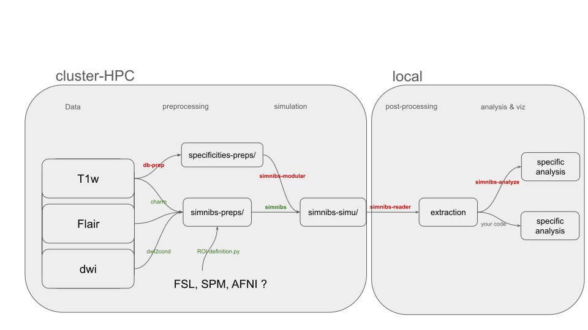

---
hide:
  - navigation
---
# OptiStims

!!! warning "Placeholder"
    This repository is a placeholder. The pipeline described below is
    documented here so the ecosystem has a single home for it; the code still
    lives across `simnibs-modular`, `simnibs-reader` and `simnibs-analyze`.

**End-to-end automated pipeline for stroke lesion-aware tDCS simulation and analysis.**

---

## ⚡️ Automated Stroke Pipeline

{ width="100%" }

*From raw MRI to cohort-level e-field statistics and figures, with lesion-aware
head modelling throughout.*

---

## Ecosystem

-   :fontawesome-solid-brain:{ .lg .middle } **SimNIBS**

    ---

    The core simulation platform for non-invasive brain stimulation.

    [:octicons-arrow-right-24: Documentation ](https://simnibs.github.io/simnibs/build/html/index.html)

-   :material-package-variant:{ .lg .middle } **simnibs-modular**

    ---

    Modular pipeline components for SimNIBS workflows.

    [:octicons-arrow-right-24: GitHub Pages](https://ICM-Frontlab-CDPR.github.io/simnibs-modular/)
    · [:octicons-mark-github-16: Repo](https://github.com/ICM-Frontlab-CDPR/simnibs-modular)

-   :material-file-tree:{ .lg .middle } **simnibs-reader**

    ---

    Structured access to SimNIBS output trees, ROIs and statistics.

    [:octicons-arrow-right-24: GitHub Pages](https://ICM-Frontlab-CDPR.github.io/simnibs-reader/)
    · [:octicons-mark-github-16: Repo](https://github.com/ICM-Frontlab-CDPR/simnibs-reader)

-   :material-chart-bar:{ .lg .middle } **simnibs-analyze**

    ---

    Statistical analysis tools for SimNIBS outputs.

    [:octicons-arrow-right-24: GitHub Pages](https://ICM-Frontlab-CDPR.github.io/simnibs-analyze/)
    · [:octicons-mark-github-16: Repo](https://github.com/ICM-Frontlab-CDPR/simnibs-analyze)

